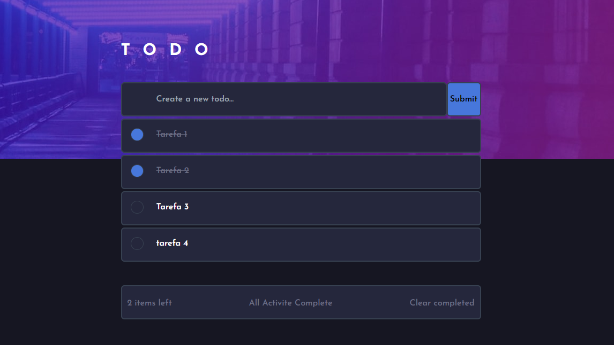

# Todo App

Um simples aplicativo de lista de tarefas criado com propósitos de estudo.

## Autor

- [@fredybraun](https://www.github.com/fredybraun)

## Stack utilizada

**Front-end:** React, TailwindCSS

**Back-end:** Node, Prisma, Fastify

## Funcionalidades
- Criar tarefas
- Concluir tarefas
- Remover tarefas concluídas

## Referência

 - [Figma Template](https://www.figma.com/community/file/1152429650301051369)
 
## Screenshots

